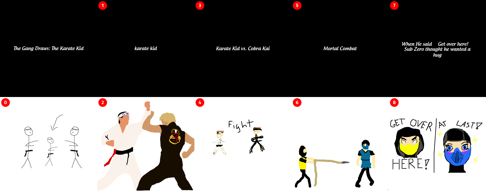
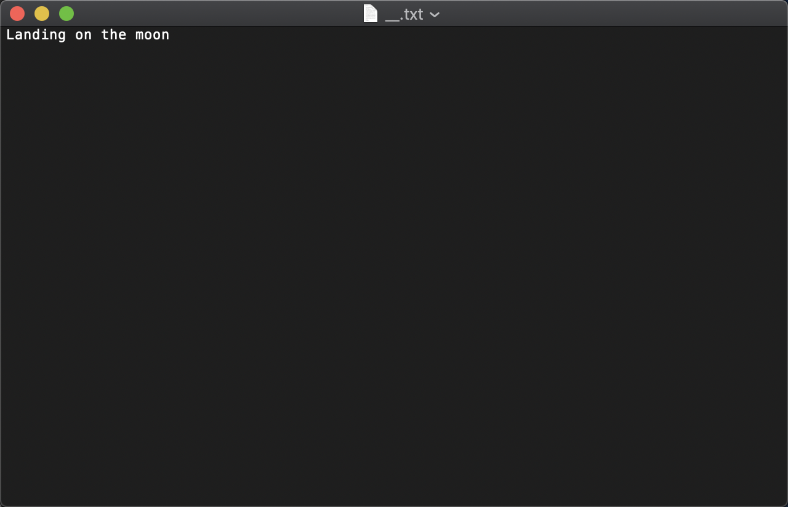

# Telestrations Graphic Generator

Generates three types of graphics: all view, scroller, and gif

# Table of Contents
- [Examples of Graphics](#examples-of-graphics)

    - [All View](#all-view)
    
    - [GIF](#gif)
    
    - [Scroller](#scroller)
- [Input structure](#input-structure)

    - [Input directory](#input-directory)
    
    - [Key file](#key-file)
    
    - [Topic submissions](#topic-submissions)
    
    - [Topic file](#topic-file)
- [Dependencies](#dependencies)
- [Usage](#usage)
- [How the game is played](#how-the-game-is-played)
- [Latest Features](#latest-features)
- [Roadmap](#roadmap)

### Examples of Graphics
#### All View


Great for embedding in emails.

#### GIF


Look! It moves!

#### Scroller


Good for thumb scrolling on mobile.

## Input structure

#### Input directory


Each letter represents a topic that your group iterated through with their interpretations.

#### Key file


Has the association of submission numbers and names. These numbers are used as the file names for the 
submissions and correspond to the order of the game.

#### Topic submissions


The submissions both phrase and drawing for a topic that your group iterated through. 

#### Topic file


The seed topic that player 00 created.


 ## Dependencies
 Install this font for proper lettering: https://www.dafont.com/androgyne.font
 install this font for proper numbering: https://fonts.google.com/specimen/Titillium+Web
 
 Install python-magic
 https://github.com/ahupp/python-magic

```
Debian/Ubuntu

$ sudo apt-get install libmagic1

Windows

You'll need DLLs for libmagic. @julian-r has uploaded a version of this project that includes binaries to PyPI: https://pypi.python.org/pypi/python-magic-bin/0.4.14

Other sources of the libraries in the past have been File for Windows . You will need to copy the file magic out of [binary-zip]\share\misc, and pass its location to Magic(magic_file=...).

If you are using a 64-bit build of python, you'll need 64-bit libmagic binaries which can be found here: https://github.com/pidydx/libmagicwin64. Newer version can be found here: https://github.com/nscaife/file-windows.

OSX

When using Homebrew: brew install libmagic
```

## Usage

```$ python main.py INPUT_DIRECTORY OUTPUT_DIRECTORY```

## How the game is played

Ask Jason.

## Latest Features

- supports .rtf
- cross platform
- this fricken readme

## Roadmap
 
 - determine frame length based on amount of text and type?
 - font size according to image size
 - fix centering of circle
 - create gif with circle on images
 - make a live photo version of this
 - analyze phrases and make off the rail meter graphic-> put in gif
 - zip items into folder not folder itself
 - if double digits then center it number over circle in all view
 
 
 # fix today
 - arg for week number
 - centering number
 - making sure text fits for title card
